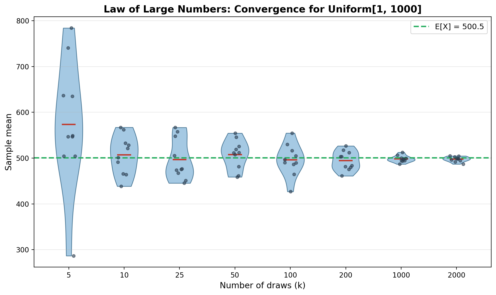

# Law of Large Numbers — BET 105 Assignment

**Yash Bansal | 23124044**

Demonstrates LLN by sampling from Uniform[1, 1000]. As draw size `k` increases, sample means converge to E[X] = 500.5.

## Run

```bash
pip install numpy matplotlib snakemake
snakemake --cores 1
```

## Result


